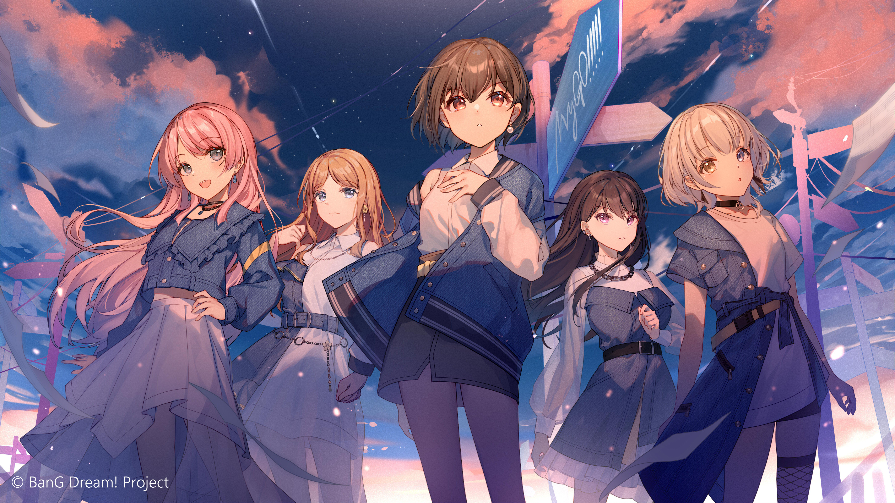
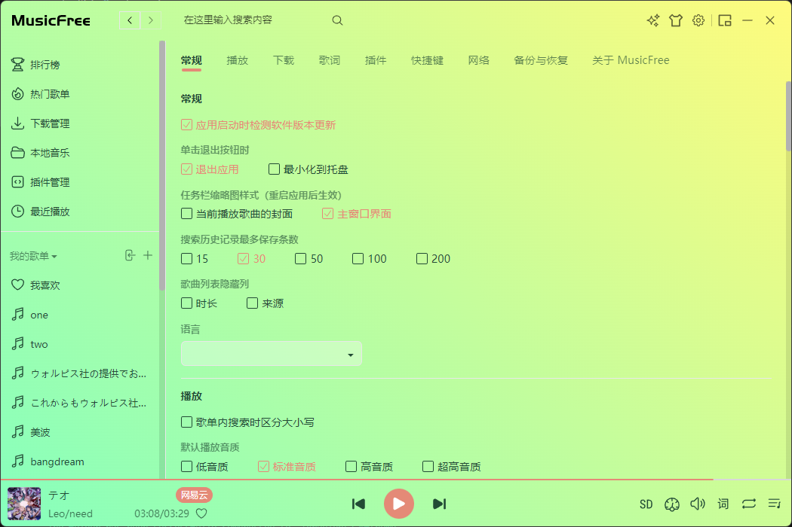
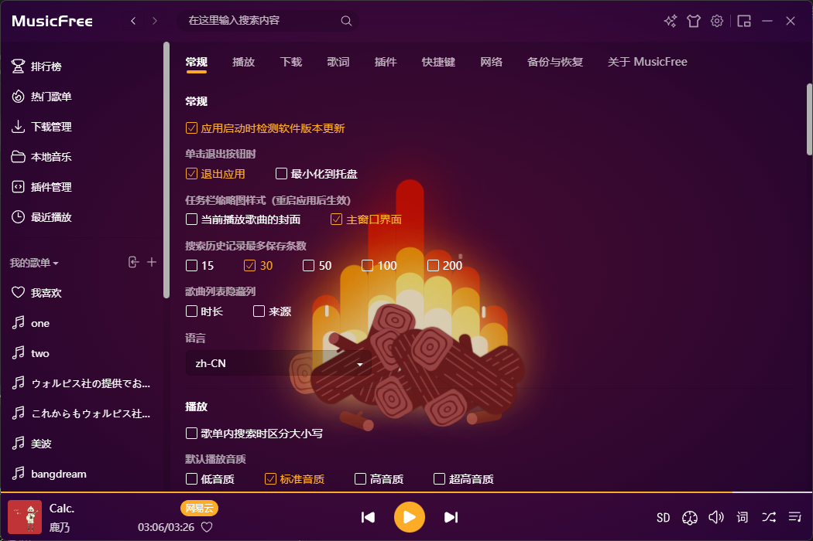
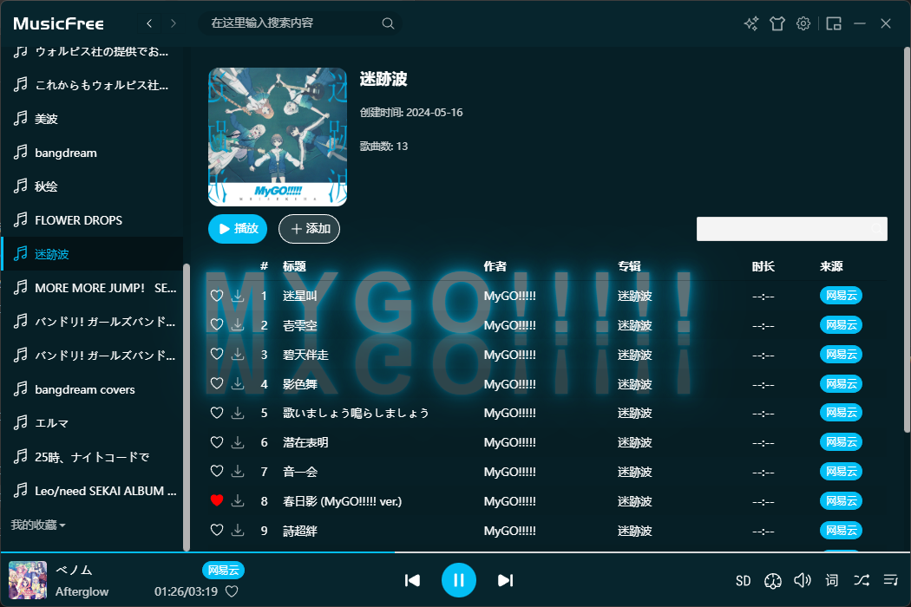

# MusicFreeThemes

自己写的MusicFree的一些主题包，使用的插画都是作者表明可以转载的，不要商用。

主题文件description都写了封面作者的名字和原图链接，此外 [lend list](./lendlist.md) 也依次列出。

部分作品，如blue archive noa, coze log等，仅供个人学习、研究或者欣赏。本仓库与NEXON Korea Corp. & NEXON GAMES Co.等相关实体没有任何关系，这部分作品仅用于学习、研究或个人使用、欣赏，不用于商业目的。如果认为本仓库中的内容侵犯了其版权或其他权权利，请与我联系，我会立即采取适当措施。

未公开声明可以转载的作品会在[lend list](./lendlist.md)里全部列出。

# 使用方法

查看原作者 https://github.com/maotoumao/MusicFreeDesktop 的主题包条目

# lend list

[💖主题包使用的插画作者和来源](./lendlist.md)

# 预览

mygo.mftheme

autumn.mftheme

sakuraMiku

gradient.mftheme

gradient2.mftheme

coze_log

tubeLightText

BlueArchive Noa

flyingChibi
